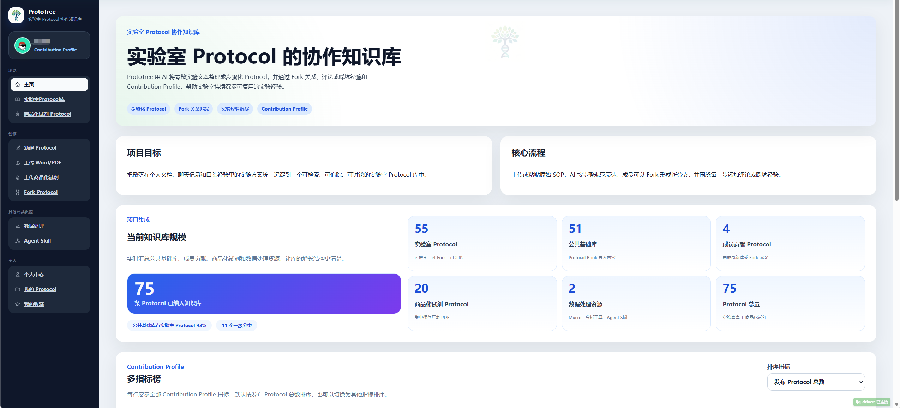

# ProtoTree



ProtoTree is a laboratory protocol sharing system with a FastAPI backend and a Vite/React frontend.

## Showcase

Promotional screenshots with anonymized sample data are available in [`docs/showcase`](docs/showcase):

- [Product home screenshot](docs/showcase/prototree-product-home.png)
- [Overview dashboard](docs/showcase/prototree-overview.png)
- [Protocol library search](docs/showcase/prototree-library.png)
- [AI-assisted upload editor](docs/showcase/prototree-editor.png)
- [Contribution profile](docs/showcase/prototree-profile.png)

## Local Development

1. Copy `.env.example` to `.env` and fill in local values.
2. Start the backend:

```powershell
.\start-backend-local.ps1
```

3. Start the frontend:

```powershell
.\start-frontend-local.ps1
```

The default frontend URL is `http://127.0.0.1:5173`, and the backend health check is `http://127.0.0.1:8000/health`.

## Database

PostgreSQL is the intended deployment database. Run migrations before serving a fresh environment:

```powershell
cd backend
alembic upgrade head
```

SQLite remains supported for local development through the backend startup initializer.

## Verification

```powershell
python -m compileall -q backend\app
cd frontend
npm.cmd run lint
npm.cmd run build
```

## Runtime Data

Do not commit local runtime artifacts such as `.env`, `.venv`, `node_modules`, `dist`, `*.db`, `storage`, or `.uploads`.
